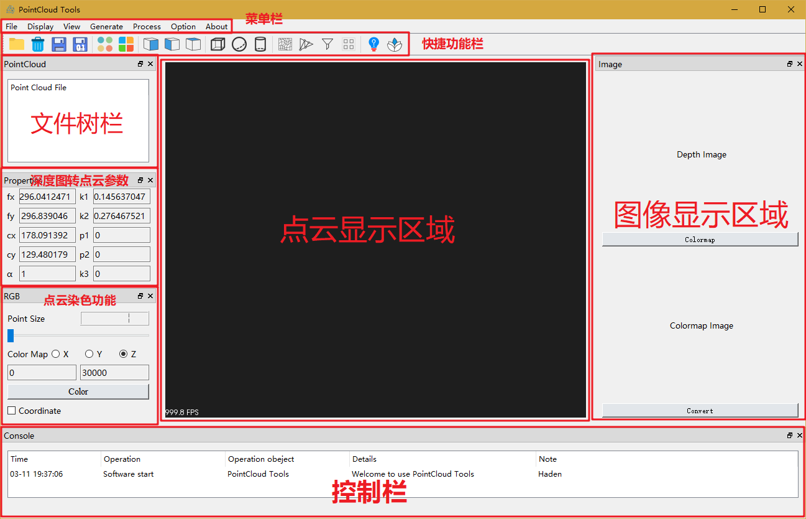
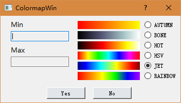
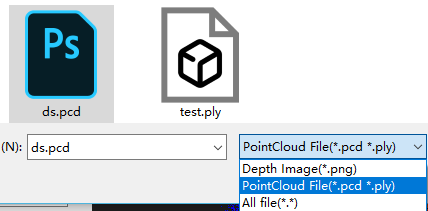
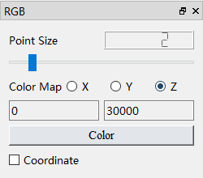
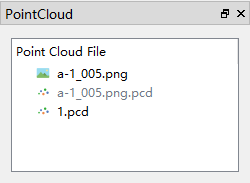
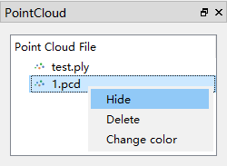
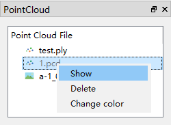

# PointCloudTools

## Description
基于Qt、PCL和OpenCV的可视化点云操作软件，提供从8位、16位深度图像转点云的功能，并提供简单的点云曲面重构、三角化、滤波、降采样等功能。  
  
## Software
Windows 10  
Visual Studio 2013  
PCL 1.8.0  64bit  
OpenCV 2.4.13  64bit  
Qt 5.7.0  64bit  

## Compiling
**（仅测试windows）**
* 复制opencv2.4.13环境文件到工程目录下，debug/release分别命名为：OpenCV2.4_Win64_Debug.props和OpenCV2.4_Win64_Release.props（更高版本应该也支持，但没有测试）
* 复制pcl1.8.0环境文件到工程目录下，debug/release分别命名为：PCL_1.8.0_x64_debug.props和PCL_1.8.0_x64_release.props（更高版本应该也支持，但没有测试）
* 用vs打开工程（我们使用VS 2013）
* 解决方案平台选择x64（如果没有请创建）
* QT VS TOOLS->Qt Project Settings，设置Qt版本（仅测试了Qt 5.7.0）
* 编译

## Summary
双击PointCloudTools.exe即可运行，TestData文件夹下存放测试文件。  
界面分为菜单栏、快捷功能栏、图像显示区域、点云显示区域和其他参数辅助窗口。
  
### 1. 图片功能  
包括图片打开显示、伪彩色显示功能。  
#### 1.1 打开
快捷功能栏点击或菜单栏点击File->Open。  
选择要打开的图片，图像显示区域会显示图像。  
可以打开.png .jpg .bmp等常见图像，希望打开的是16位单通道图像，如果是别的图像也会正常打开，但是后续操作会引起错误。  
#### 1.2 伪彩色显示
深度图像下“Colormap”按钮，点击后弹出选择框。  
  
Min下输入伪彩色下限，Max下输入伪彩色上限，超出范围的像素则按最大、最小染色。  
右边可以选择伪彩色图样式。输入完成后点击“Yes”生成伪彩色图。  
#### 1.3 点云转换
伪彩色图像下“Convert”按钮，点击后根据打开的图像生成点云。  
点云转换参数在“properties”窗口下。  
根据畸变矫正原理，需要给定相机内参和畸变系数。  
相机内参矩阵形式为：  
相机径向畸变模型为：  
α为缩放系数，转换后的点云距离 dist = pix / α  
更多原理介绍见 [王乐,罗宇,王海宽,费敏锐.ToF深度相机测量误差校正模型[J].系统仿真学报,2017,29(10):2323-2329.](http://kns.cnki.net/KCMS/detail/detail.aspx?dbcode=CJFQ&dbname=CJFDLAST2018&filename=XTFZ201710013&uid=WEEvREcwSlJHSldRa1FhdXNXaEd1OFFtSXo4Sm13QTFidGg0NkprV0NZTT0=$9A4hF_YAuvQ5obgVAqNKPCYcEjKensW4IQMovwHtwkF4VYPoHbKxJw!!&v=MTU0MTlJUFRuTmRMRzRIOWJOcjQ5RVo0UjhlWDFMdXhZUzdEaDFUM3FUcldNMUZyQ1VSTE9mWk9kdUZDamtWTHI=)  
程序运行目录下，可以通过编辑config.ini文件，程序会自动填充畸变参数，避免每次运行程序都输入参数。  
**注意：请根据实际采集相机填写畸变矫正参数**  

### 2. 点云功能
包括点云文件打开、保存、伪彩色显示和常见滤波、曲面重构功能。  
#### 2.1 打开
快捷功能栏点击或菜单栏点击File->Open。  
支持打开pcd和ply格式点云文件。在弹出框中下拉框选择“PointCloud”文件格式，即可看到点云文件，点击即可打开。  
打开点云会在点云显示区域显示。  
  
#### 2.2 点云保存  
保存功能将会保存所有可见点云。  
快捷功能栏点击或者菜单栏点击File->Save，选择保存路径，保存pcd或者ply格式点云。  
快捷功能栏点击或者菜单栏点击File->Save as binary，选择保存路径，以二进制保存pcd或者ply格式点云，提供读取写入速度。  
#### 2.3 点云信息查看
点云显示窗口，按shift鼠标左键点击点云，会显示最近点坐标信息，方便调试。  
#### 2.4 点云显示大小
点云染色功能窗口，拖动“Point Size”下滑块可以快速调节显示点大小。从1-10可选。  
如果在文件树窗口选择了点云文件，则该文件点云显示大小改变，否则所有显示点云点大小都改变。  
  
#### 2.5 点云伪彩色显示
可以根据某轴上点的分布染色，选择坐标轴，输入染色范围数值，点击“Color”即可染色。  
如果在文件树窗口选择了点云文件，则该文件点云显示大小改变，否则所有显示点云点大小都改变。  
**注意：左边请输入染色范围最小值，右边请输入最大值！**  
#### 2.6 参考坐标轴显示
点云染色功能窗口下可以点击“Coordinate”选框，勾选后点云显示区域会显示三轴坐标。  
#### 2.7 点云颜色改变
快捷功能栏点击或者菜单栏点击Display->Point cloud color，或者文件树窗口选择点云后右键弹出选择列表，点击“Change color”都可改变点云颜色。  
如果文件树窗口选择了文件，则改变对应点云颜色，否则改变所有显示的点云颜色。  
#### 2.8 点云背景改变
快捷功能栏点击或者菜单栏点击Display->Background Color，修改点云显示窗口背景颜色。  
#### 2.9 点云视角改变
除了可以使用鼠标拖动视角，还可以通过快捷功能栏点击选择默认的主视图、侧视图和俯视图。  
#### 2.10 生成默认点云
程序内置了正方体、球体和圆柱体随机点云生成功能，快捷功能栏点击生成。  
#### 2.11 曲面拟合平面显示
程序内置曲面拟合功能，快捷功能栏点击弹出选择框，输入参数后将会对所有**显示的点**计算曲面拟合，并以面的形式展示。  
**计算时间根据显示点数、参数选择不同可能会比较长**  
#### 2.12 曲面拟合三角连线显示
程序内置曲面拟合功能，快捷功能栏点击弹出选择框，输入参数后将会对所有**显示的点**计算曲面拟合，并以三角线的形式展示。  
**计算时间根据显示点数、参数选择不同可能会比较长**  
#### 2.13 基于统计的滤波
点击快捷功能栏调用PCL的StatisticalOutlierRemoval类，对显示的点进行滤波。  
#### 2.14 体素降采样
点击快捷功能栏调用PCL的VoxelGrid类，对显示的点进行降采样。  

### 3. 文件管理
所有打开的图片、点云文件和转换的点云都会在文件树窗口显示。  
图片一次只能显示一张，点云窗口可以同时显示多个点云文件内容，没有显示的则灰色。  
文件选择可多选。  
  
#### 3.1 隐藏
文件树窗口选择文件后，右键弹出选择列表，点击“Hide”即可隐藏对应**点云**文件。  
  
#### 3.2 显示
文件树窗口选择文件后，右键弹出选择列表，点击“Show”即可显示对应**点云**或**图片**文件。  
  
#### 3.3 删除
文件树窗口选择文件后，右键弹出选择列表，点击“Delete”即可从内存中删除**点云**或**图片**。  
#### 3.4 点云颜色改变
文件树窗口选择点云文件后，右键弹出选择列表，点击“Change Color”可以快速更改对应点云颜色。  

### 4. 其他功能  
#### 4.1 主题颜色改变（未实现）
#### 4.2 语言选择（未实现）

# Thanks
特别感谢 [nightn](http://nightn.com/) 及他的 [CloudViewer](https://github.com/nightn/CloudViewer)
